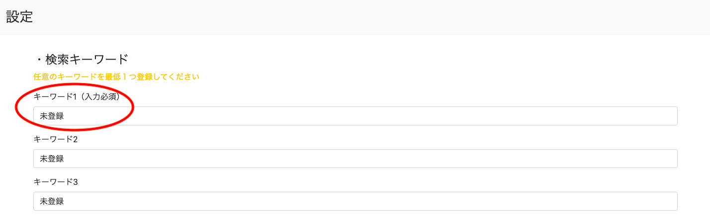
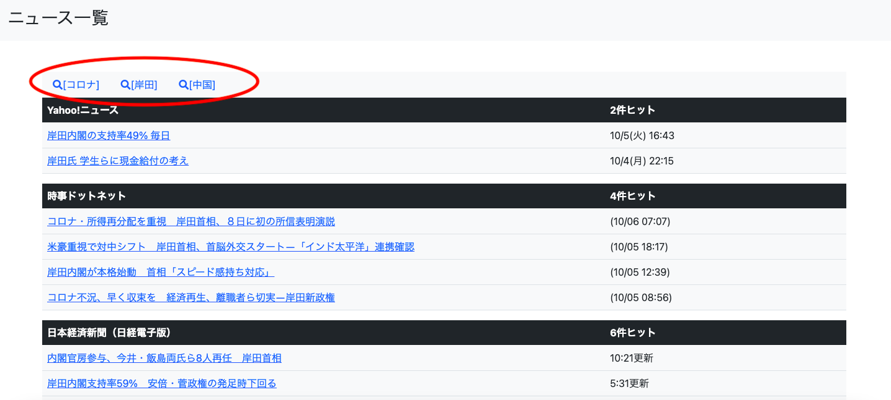

# [newsHunt](https://newshunt2021.herokuapp.com/)  
newsHuntは複数のニュースサイトから指定した任意のキーワードを含むニュース記事を検索して一覧表示するwebアプリケーションです。  
  
# 使用方法  
1.検索キーワード  
新規ユーザー登録またはゲストログイン後遷移される設定ページにて任意のキーワードを最低１つキーワード１に入力してください。    
  
  
2.検索対象サイトを選択し、登録ボタンをクリックしてください。  

  
  
3.メイン画面が表示されます。ニュース一覧上部のタブ（登録したキーワード）をクリックすると検索が始まり画面が読み込まれます。  
  
  
  
  
  
### 開発環境
OS:macOS Big Sur  
言語:Python3,HTML/CSS  
仮想環境:venv  
フレームワーク:Django,Bootstrap5  
データベース:MySQL  
インフラ:Heroku  
  
### 開発に至った経緯
ニュースサイトは基本的にメディア側からの一方通行の情報になるため個人が自由に必要な情報のみを取得するツールがあったらいいなと思い開発に至りました。  
また同じ事件や事柄であってもメディアによって報道の仕方は様々です。同じ内容に対して複数のサイト、記事を比較検討することで情報リテラシーの向上にも役立つのではないかと考えました。
  
### 開発期間  
約1ヶ月半  
  
### 工夫した点
・ニュースの検索を行う際、GETでページを取得しているためパラメーターがないとニュースを全件スクレイピングし、読み込みが重くなってしまうため、キーワードを登録していないユーザーに対しては設定ページへ画面を強制遷移し、キーワード登録を促すようにした。  
・ゲストログインの追加。ゲストユーザーの設定はデータベースに保存されるが、ログアウト時に削除（使い回しができるように）、セッションは5分間に設定。 
　　
### 苦労した点
・フルスタックのフレームワークを初めて使ったので構造を理解するのに苦労した。  
・フォームをテンプレートに反映させる際にBootstrapで整形するのが難しく、時間がかかった。 
・Djangoのクエリ（SQL文）が独特で難しかった。
・Model（データベース）の設計が甘かったため、後に改善が必要になる場面があった。
・サーバーはHerokuを利用したが初めてのデプロイということもあり苦労した。    
  
### 改善点
・beautifulsoupだと動的に画面遷移するサイトにはスクレイピングの対応ができないためselenium等を導入する必要がある。  
・ニュース一覧画面で読み込めるニュースサイト数、件数が少ない。ソート機能が不十分。  
・ユーザーテーブルのUPDATE,DELETE機能が現状ない。（認証に使用したallauthにUPDATE機能が備わっていないため）    
  
### 動作テスト済項目
・画面遷移および全ページの表示テスト  
・ユーザー登録のテスト及びメール送信のテスト  
・フォームのバリデーションテスト  
・データベースのテスト（INSERT,UPDATE） 
  
### 参考にしたリソース
・Udemyの講座 - 【徹底的に解説！】Djangoの基礎をマスターして、3つのアプリを作ろう！  
・書籍 - 現場で使える Django の教科書《基礎編》  
・Qiita、Stack Overflow、その他ブログ等
